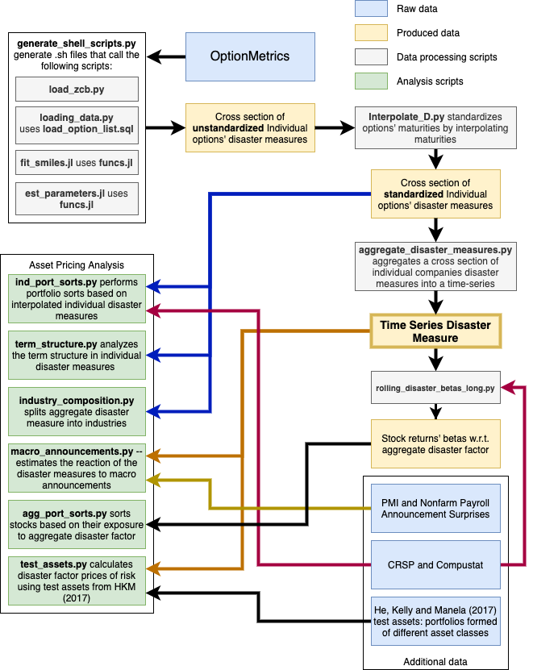

# disaster-risk-revision

This code is written in two languages: Python 3.5 and Julia 1.0. Python is used for loading data from WRDS server using their SQL-Python library and for less computationally demanding pieces, though some of these take some time to run. Julia scripts are written to use in parallel and are used for more computationally demanding exercises: fitting Stochastic Volatility Inspired smiles into implied volatilities reported by OptionMetrics and for numerical integration. Distributed over 3 AWS machines each using 8 cores and having 32GB RAM, the Julia part of the code runs for approximately 100 hours.

The high level of the workflow is presented in the Figure below. A more detailed description of main scripts follows

## Scripts Used to Generate Disaster Measures

### Individual Options

1. `generate_shell_scripts.py` — generates shell scripts for loading data, fitting smiles and calculating disaster measures. The script itself contains hard parameters that can be easily modified: start year, end year, name that is appended to files, size of a single group and whether to delete raw option data after estimation.
2. `load_zcb.py` -- python code for downloading ZCB rates from OptionMetrics required to calculate option prices. Saves file to *data/raw_data/zcb_data.csv*
3. `loading_data.py` — python script that uses SQL code from *load_option_list.sql* to load option data from OptionMetrics as well as data on distributions (e.g. dividends). SQL code applies filters described in Table 10 in Siriwardane (2015) with an exception of filters that depend on the present value of dividends (this is done at a later stage). This script is executed with the following command in the terminal `python loading_data.py -s 101549,143076,166820,147640,112361  -b 1996 -e 2017 -o file_appendix`. This loads data for 5 different SECIDs for each year in 1996 to 2017 interval. It saves two files. First, it saves option price data in `data/raw_data/opt_data_file_appendix.csv`. Second it saves distributions data in `data/raw_data/dist_data_file_appendix.csv`.
4. `load_option_list.sql` — SQL script that is used by `loading_data.py` script and contains filters.
5. `funcs.jl` — file with functions for the main Julia algorithm to fit SVI and estimate D for individual options data
6. `fit_smiles.jl` — Julia script optimized for parallelization to fit SVI smile into implied volatilities reported in OptionMetrics. SVI smile has functional form described in Zeliade (2009). We impose \rho = 0 following appendix of Berger, Dew-Becker, and Giglio "Uncertainty shocks as second-moment news shocks" (WP, 2019). Note that this file is written for individual options as they have discrete dividends that need to be taken care off when calculating forward prices that enters Black-Scholes formula. Execute script with the following command `julia -p 7 fit_smiles.jl file_appendix`  using 1+7 cores. Requires files saved in previous steps `data/raw_data/opt_data_file_appendix.csv`, `data/raw_data/dist_data_file_appendix.csv` and `data/raw_data/zcb_data.csv`. Output a single file `data/raw_data/svi_params_file_appendix.csv` that contains estimated SVI parameters for each smile.
7. `est_parameters.jl` — julia script optimized for parallelization that calculates smile level (secid-date-maturity level) disaster measures. Use as `julia -p 7 fit_smiles_index.jl file_appendix`. Uses file calculated in the previous step `data/raw_data/svi_params_file_appendix.csv`. Outputs a single file `data/raw_data/data/output/var_ests_file_appendix.csv` with `V_in_sample, IV_in_sample, V_clamp, IV_clamp, rn_prob_sigma,rn_prob_2sigma, rn_prob_20, rn_prob_40, rn_prob_60, rn_prob_80` on a smile level.
8. `interpolate_D.py` — takes files with calculated V and IV (all files from folder `estimated_data/V_IV/`) and linearly interpolated measure to a certain maturity, e.g. 30 days. To run the script use `python interpolated_D.py 30` where 30 is maturity of interpolated in *days*. Saves interpolated individual disaster panel as `estimated_data/interpolated_D/int_ind_disaster_30.csv`.
   1. The script itself contains path to folder (shouldn't be necessary if correctly run the dcript) and a suffix for files to use in interpolation
9. `aggregate_disaster_measures.py` — loads individual interpolated disaster data from the previous step   applies filters (e.g. requires a company-month to have at least 10 daily observations to be included into the average) truncates cross-sectionally observations at 1% level on both sides and calculates a simple average of disaster measures cross-sectionally for each month. Saves results in `estimated_data/disaster_risk_measures/disaster_risk_measures.csv`.
   1. **Need to be careful about what files are being used and saved**

### Index Options

1. `loading_data_index.py` — script to load data for indices. The only difference with individual stock is that dividends are continously compounded and the script loads dividend yield for each date. Use also as`python loading_data.py -s 101549,143076,166820,147640,112361  -b 1996 -e 2017 -o file_appendix` and it outputs two files: `data/raw_data/opt_data_file_appendix.csv` for option data and `data/raw_data/div_yield_file_appendix.csv` for dividend yield
2. `fit_smiles_index.jl` —  Julia file to fit SVI for indices. Use as `julia -p 7 fit_smiles_index.jl file_appendix`. Outputs `data/raw_data/svi_params_file_appendix.csv`
3. `est_parameters_index.jl` — julia script to calculate disaster measures for indices. Use as `julia -p 7 fit_smiles_index.jl file_appendix` . Outputs `data/output/var_ests_file_appendix.csv`.

## Analysis Files

1. analysis.py, calculate_D.py, compare_Ds.py, compare_clamp.py -- various files to load estimated data and calculate D + compare them and with Emil's measure of D

2. final_generating_scripts.py, generate_scripts.py, track_progress.py -- python files to generate shell scripts to estimate Ds

3. large_sigma_share.py -- share of observations with sigmas > 1

4. ind_port_sorts.py -- takes interpolated individual disaster measures for different number of days `estimated_data/interpolated_D/int_ind_disaster_union_cs_{days}.csv` and performs portfolio sorts based on two types of measures. First, based on disaster measure for a particular horizon (e.g. 60 days or 120 days). Second, based on average of 30,60,...,180 days (i.e. a level factor). It then outputs monthly returns for these strategies as well as average operating profitability for each portfolio-month and average book-to-market for each portfolio month. It saves results as `estimated_data/disaster_sorts/port_sort_ret_ind.csv`, `estimated_data/disaster_sorts/port_sort_op_ind.csv`, `estimated_data/disaster_sorts/port_sort_bm_ind.csv`, respectively.

5. disaster_port_reg_on_ff.py -- estimating alphas using factors from Fama and
French for the sorted portfolios that we obtained on the previous step

5. test_assets.py -- uses test assets from He, Kelly and Manela (JFE, 2017) located in file `data/He_Kelly_Manela_Factors_And_Test_Assets_monthly.csv` to calculate prices of risks for the disaster factor using GMM following Cochrane's textbook.

6. macro_announcements.py -- estimates the reaction of the disaster measures to macro announcements: PMI and Nonfarm payroll (located in `data/ism_pmi_announcements.csv` and `data/nonfarm_payroll_announcements.csv`). Saves estimates in `estimated_data/macro_announcements/pmi_react.csv` and `estimated_data/macro_announcements/nonfarm_react.csv`, respectively.

7. term_structure.py -- analyzes term structure of the disaster measure to see how much variation is coming from level factor (common to disaster measures estimated from options of all maturities), from slope (opposite signs of close and far maturity options) and curvature. Uses `estimated_data/interpolated_D/int_ind_disaster_union_cs_{days}.csv` files.

8. rolling_disaster_betas_long.py and agg_port_sorts.py -- the first script estimates rolling beta of stock returns on aggregate disaster measures. The second performs portfolio sorts based on these rolling betas.

9. load_spx_Cremers.py, load_options_spx_cremers.sql, cremers_factor_replication.py and cremers_factor_sorts.py -- load_spx_Cremers.py uses load_options_spx_cremers.sql to load data for replication of JUMP factor from Cremers, Halling and Weinbaum (JF, 2014).
cremers_factor_replication.py then constructs the factor and the last script performs portfolio sorts based on that factor.

10. industry_composition.py -- looks into the industry composition, i.e. how much of average disaster measure comes from each FF industry.

11. volume_weight_factor.py -- uses data on trading volume and open interest of options from `estimated_data/option_volume/option_volume_1/2/3.csv` to weight individual disaster measures.

12. compare_disaster_series.R -- comparing disaster series constructed in different ways

## Outputting results

1. SS_figures.py and SS_tables.py -- outputting figures and tables with results.

## Scripts with simulation results

1. simulations.jl -- main simulation file to assess accuracy and sensitivity of D to parameters when the process involves two jump processes

2. simulations_upper_limits.jl -- simulation to assess sensitivity of estimate to upper limit of integration

3. simulations_PCA.py, simulations_PCA.jl, simulations_PCA_parallel.jl, simulations_disaster_share.jl, simulation_funcs.jl -- files to simulations to assess performance of PCA in identifying the common component when noise is not iid

4. simulation_plots.R -- R code to plot simulation results

## Supporting scripts

1. crsp_comp.py -- supporting functions for anything CRSP/Compustat related

2. EAPv2.py -- module for empirical asset pricing developed by Emil Siriwardane and augemted by Roman Sigalov.

3. alpha_analysis_functions.py -- functions for analysis of alphas that is used by EAPv2.py

## Other files

1. old_CME_data.py -- processing options data directly from CME

2. fit_smiles_old_CME.jl -- fitting smiles into CME options data
